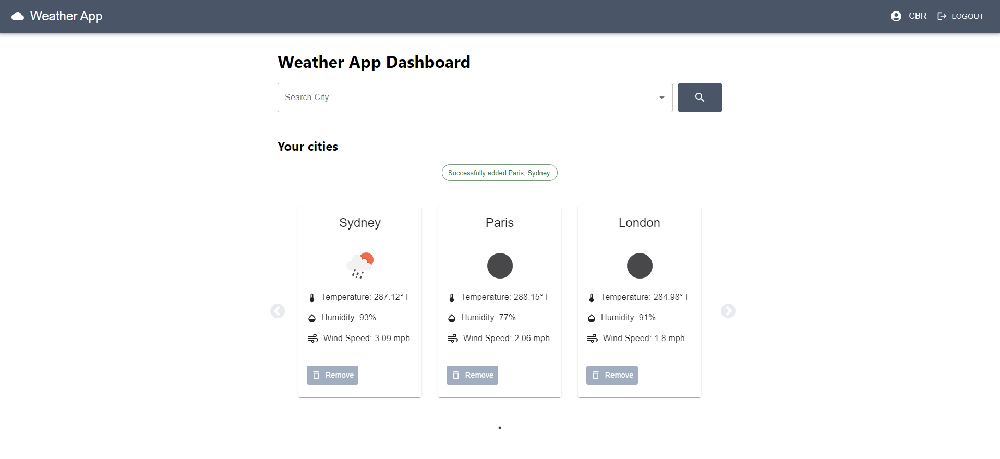

# Weather App

## Overview

The Weather App is a web application designed to display weather information for cities around the world. Users can search for cities, view current weather conditions, and manage a list of saved cities.

### Features

- **Search:** Users can search for cities to view current weather information.
- **City Management:** Users can add and remove cities from their saved list.
- **Weather Details:** Display temperature, humidity, and wind speed for each city.
- **Responsive Design:** Ensures a consistent experience across different devices.

## Technologies Used

- **React:** Front-end library for building user interfaces.
- **Redux Toolkit:** State management library for managing application state.
- **Material-UI:** React component library for UI design.
- **Axios:** Promise-based HTTP client for making requests to the OpenWeatherMap API.
- **React Slick:** Carousel component for displaying weather cards.
- **Webpack:** Module bundler for building and running the application.
- **Jest and React Testing Library:** For unit testing and integration testing.

## Setup Instructions

To run the Weather App locally, follow these steps:

1. **Clone the repository:**
   `git clone <repository-url>`
   `cd weather-app`

2. **Install dependencies:**
   `npm install`

3. **Set up environment variables:**
   Create a `.env` file in the root directory and add your OpenWeatherMap API key:
   `REACT_APP_API_KEY=your_api_key_here`

4. **Ensure Node.js version 16+:**
   Make sure you are using Node.js version 16 or higher, as it is fundamental for this app.

5. **Start the application:**
   `npm start`

6. **Open in the browser:**
   Open [http://localhost:3000](http://localhost:3000) to view the app in your browser.

## Build Instructions

To build the project for production, run:

`npm run build`

This will generate a dist directory containing the production build of the application.

## Usage

- **Search for a city:** Enter a city name in the search input and press Enter or click the search button.
- **Manage cities:** Add or remove cities from the list displayed on the dashboard.
- **View weather details:** Check the temperature, humidity, and wind speed for each city displayed on the weather cards.

## Authentication

For the login page, the username and password can be anything as there is no authentication validation implemented at this moment.

## Testing

Run tests to ensure the app functions as expected:
`npm test`

## Design Choices and Architecture

- **Component-Based Architecture:** The app is built using React, following a component-based architecture to promote reusability and maintainability.
- **State Management with Redux Toolkit:** Redux Toolkit is used for managing the global state of the application, making it easier to handle state changes and asynchronous operations.
- **Material-UI for UI Design:** Material-UI is used for consistent and responsive UI components.
- **Webpack for Module Bundling:** Webpack is configured to bundle the application modules and assets, and to enable hot-reloading during development for a better developer experience.

## Credits

- **Icons:** Weather icons provided by [OpenWeatherMap](https://openweathermap.org/weather-conditions).

## License

This project is licensed under the MIT License - see the LICENSE file for details.
